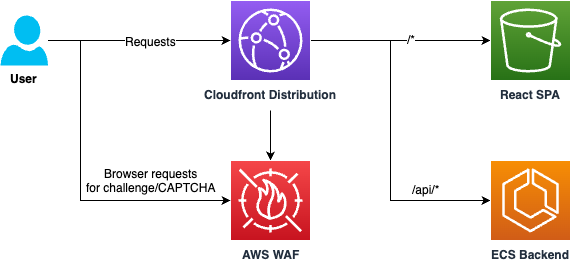

# AWS WAF Javascript CAPTCHA API Integration with React
This project demonstrates how to integrate the AWS WAF CAPTCHA Javascript API into your React Single Page Application (SPA). It is a simple todo frontend/backend web application that presents AWS WAF CAPTCHAs in modal form. The high level architecture of this project is illustrated below:



> [!IMPORTANT]
> This project is not expected to be deployed directly to a production environment. We recommend that you review the React code and re-use only the relevant components for your existing frontend application.

This project is organized under the following directories:
1. `backend`: A backend Express.js API application that allows users to register, sign in, and add items to their todo list. Passport.js is used to manage identity and sessions. The demonstration deploys this as a Docker container to an AWS ECS Fargate cluster. API calls are proxied through Amazon CloudFront.
2. `frontend`: A React 18 application that presents a frontend for users to register, sign in, and add items to their todo list by calling the backend application. It intercepts API calls, and presents a modal requiring the user to complete an AWS WAF CAPTCHA before completing the request. The application is based on the [Create React App](https://create-react-app.dev/) framework. The demonstration deploys this to an Amazon S3 bucket proxied through CloudFront.
3. `infra`: An AWS CDK project to deploy AWS resources for this demonstration; an S3 bucket for the frontend, and ECS cluster for the backend, all served by a CloudFront Distribution with an AWS WAF web ACL.

A user is required a complete a CAPTCHA for all POST requests (login, register, or add a new todo). In this demonstration we add React hooks/components that intercept API requests to present a CAPTCHA modal in two ways: 
1. **Native Fetch Interceptor**: This intercepts every fetch request and presents a CAPTCHA modal before completing the initial fetch request.
2. **Axios Fetch Interceptor**: This intercepts every fetch request and presents a CAPTCHA modal only if AWS WAF returns a 405 CAPTCHA required response. The initial request is re-sent once the CAPTCHA is completed.

We now walk through the steps to set up this demonstration in your account.

## Prerequisites
1. Docker: to build the backend and frontend applications
2. CDK bootstrapped in the us-east-1 region

## Deploying the Infrastructure Stack
This application is deployed to us-east-1 by using the following commands:
```
git clone https://github.com/aws-samples/aws-waf-captcha-react-demo
cd aws-waf-captcha-react-demo/infra
npm install
cdk deploy
```

The output `AWSWAFCaptchaReactStack.TodoEndpoint` presents the CloudFront URL that serves the demonstration frontend.

## Understanding the Demonstration

### AWS WAF Configuration
In this demonstration we created an AWS WAF web ACL with the following rule to allow all requests except for POST requests for which we require the user to have completed a CAPTCHA:
1. CAPTCHA Action for requests matching the POST HTTP method  

The default action is Allow and we set a [CAPTCHA immunity time](https://docs.aws.amazon.com/waf/latest/developerguide/waf-tokens-immunity-times-setting.html) of 60 seconds to demonstrate how subsequent requests require an additional CAPTCHA completion.

CDK stores the [CAPTCHA script URL](https://docs.aws.amazon.com/waf/latest/developerguide/waf-js-captcha-api.html), and [API key](https://docs.aws.amazon.com/waf/latest/developerguide/waf-js-captcha-api-key.html) for the CloudFront domain in the S3 bucket under `./wafenv.json`. This will be used to configure the frontend application.

### React Application Configuration
We add an additional component to present a modal in addition to hooks that intercept API requests and present the modal if necessary. These components can be found in the subdirectory `./frontend/src/aws-waf-captcha`.

The React Application first loads the CAPTCHA script URL and API key at page load from the S3 Bucket object `./wafenv.json` with the following command in `index.js`:

```await loadWAFEnv()```

These values are used by the component and hooks to interact with the AWS WAF service. The object `./wavenv.json` is uploaded to the S3 bucket at deployment time.

### AWS WAF CAPTCHA Modal Component
The AWS WAF Component under `./frontend/src/aws-waf-captcha/AWSWAFCaptchaModal.js` is a React portal that presents a modal and `div` for the AWS WAF CAPTCHA to be injected. It is instantiated in `./frontend/src/App.js` as: `<AWSWAFCaptchaModal/>`. The component uses styles defined in `./frontend/src/index.css`.

The component will dynamically load the AWS WAF Captcha Script URL.

### Native Browser Fetch CAPTCHA
The native browser fetch intercept method is demonstrated in `./frontend/src/Login.js` and `./frontend/src/Register.js`. We import and retrieve our React AWS WAF fetch hook as follows:
```
import { useAWSWAFCaptchaFetch } from './aws-waf-captcha'
...
const captchaFetch = useAWSWAFCaptchaFetch()
```

We replace existing `fetch` calls with `captchaFetch` - thus requiring all API requests to complete a CAPTCHA before making the API request. In `Login.js` this becomes ``captchaFetch(`${endpoint}/login/password`...``. `captchaFetch` uses the [AwsWafIntegration.fetch](https://docs.aws.amazon.com/waf/latest/developerguide/waf-js-challenge-api-fetch-wrapper.html) method to inject the token during request.

### Axios Fetch CAPTCHA
We introduce another hook into `./frontend/src/Todos.js` to intercept Axios requests and require CAPTCHA completion via a modal only if the initial request returns a 405 response from AWS WAF requiring a CAPTCHA.

As with the previous native browser fetch we first import and retrieve the React AWS WAF Axios hook:
```
import { useAWSWAFCaptchaFetch } from './aws-waf-captcha'
...
const captchaFetch = useAWSWAFCaptchaFetch((event) => {
  // Demonstrates how we can hook into the AWS WAF CAPTCHA events
  setCaptchaEvents(captchaEvents.push(event))
  console.log(captchaEvents)
})
```

This is a new Axios instance that specifically intercepts CAPTCHA requests from AWS WAF. We can optionally include a lambda function that is called for each of the [CAPTCHA API Events](https://docs.aws.amazon.com/waf/latest/developerguide/waf-js-captcha-api-specification.html): `onSuccess`, `onError`, `onLoad`, `onPuzzleTimeout`, `onPuzzleCorrect`, `onPuzzleIncorrect` in addition to `onCaptchaRequired` that is called when the user is required to complete a CAPTCHA.

We then replace the existing Axios instance with the new `captchaAxios` in the `addTask` method:
`captchaAxios.post('/tasks'...`.

The CAPTCHA token has an immunity time of 60s mean you should be able to add tasks for a minute without completing a CAPTCHA. After a minute the task creation request will be intercepted with a CAPTCHA completion modal.
